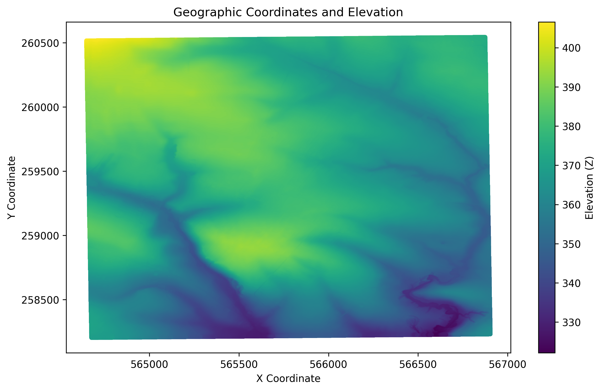
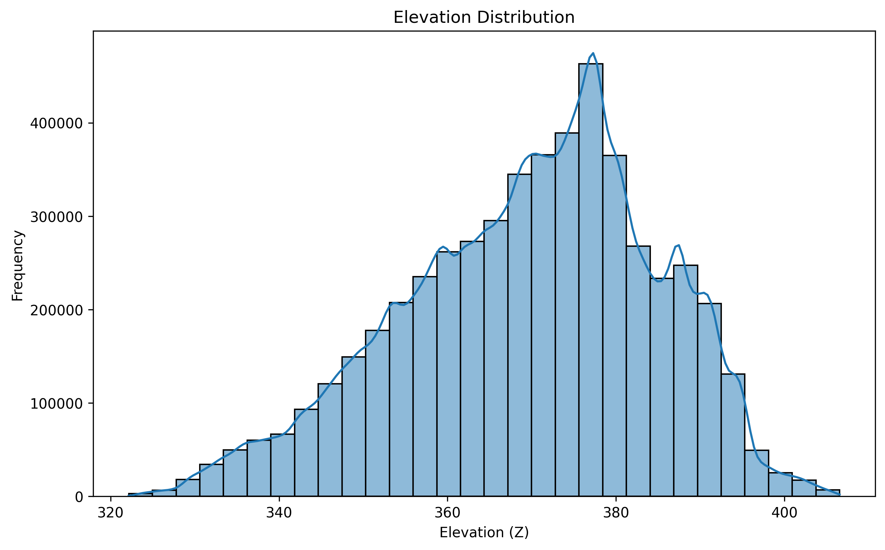

# 📌 Elevation Data Analysis and Visualization


## 📌 Project Description


This project focuses on **processing, analyzing, and visualizing elevation data** from **ASC files**.


### **Key Objectives:**


- Convert **ASC → CSV** and transform coordinates,
- Perform **statistical analysis** on terrain elevation,
- Generate **visual representations** (raster map and histogram),
- Identify elevation points **above 300 m**.


## 📂 Repository Structure


```
📦 Project
┣ 📜 Asc_to_csv.py       # Converts ASC files to CSV
┣ 📜 analyses.py         # Performs elevation data analysis and visualization
┣ 📜 README.md           # Project documentation
┣ 📂 data                # Folder with input ASC and CSV files
┗ 📂 results             # Folder containing processed data
```
In the results folder, there are compressed, unpacked, and converted data files from ASC to CSV because their original size is 128 MB, which exceeds GitHub's limit.


## 🚀 How to Run


### 1️⃣ Convert ASC to CSV


```bash
python3 Asc_to_csv.py
```


### 2️⃣ Analyze Elevation Data and Generate Plots


```bash
python3 analyses.py
```


## 📊 Analysis Results


### **📌 Correlation Matrix**


|       | X         | Y         | Z         |
| ----- | --------- | --------- | --------- |
| **X** | 1.000000  | -0.000945 | -0.407545 |
| **Y** | -0.000945 | 1.000000  | 0.642641  |
| **Z** | -0.407545 | 0.642641  | 1.000000  |


📌 **Interpretation:**


- **Strong correlation between Y and Z** (`0.642`), indicating elevation increases along the Y-axis.
- **Negative correlation between X and Z** (`-0.407`), suggesting elevation decreases along the X-axis.


---


### **📌 Points Above 300m**


| X        | Y        | Z      |
| -------- | -------- | ------ |
| 566807.5 | 260544.5 | 374.75 |
| 566808.5 | 260544.5 | 374.74 |
| 566809.5 | 260544.5 | 374.73 |
| 566810.5 | 260544.5 | 374.71 |
| 566811.5 | 260544.5 | 374.71 |


📌 **Interpretation:** High elevation points (**above 300m**) are concentrated in the upper part of the dataset.


---


## 📷 Visualizations


### 🌍 **Elevation Map**





### 📈 **Elevation Histogram**





---


## 👥 Contributors


This project was developed by:


- **Damian Siemieniec**
- **Martyna Jarosz**
- **Maja Kruszona**
